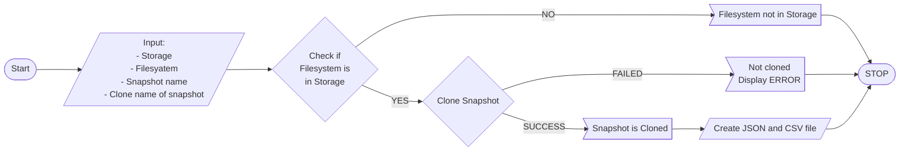

# ZFS_clone_snapshot
A program that can clone a snapshot from a ZFS storage using RestAPI,.


### Features
- `CLONE` a StorageVM into a given storage
- Helpful CLI

### Requirements
- Python 3.6 or higher
- ZFS 0.8.1 or higher (untested on earlier versions)
- Install docopt

`pip install docopt`

Check [install docopt](https://pypi.org/project/docopt/) for more information


### Usage Example
## Run the program


1. Creating a Snapshot's clone

```bash
clone_snap.py -s [STORAGE] -fs [FILESYSTEM] -sp [SNAPSHOT] -cl [CLONE] --clone
```  		

4. HELP
```
clone_snap.py -h | --help
```

- [STORAGE] => name of your storage
- [FILESYSTEM] => name of your filesystem
- [SNAPSHOT] => name of the snapshot you want to clone
- [CLONE] => clone name of the snapshot you want to clone


##FLOWCHART

